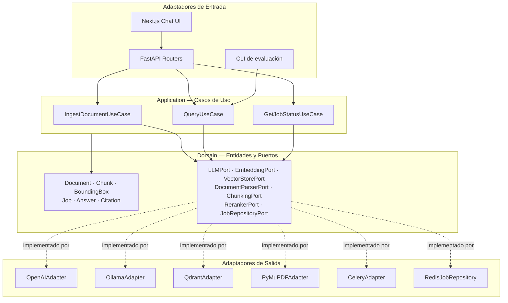
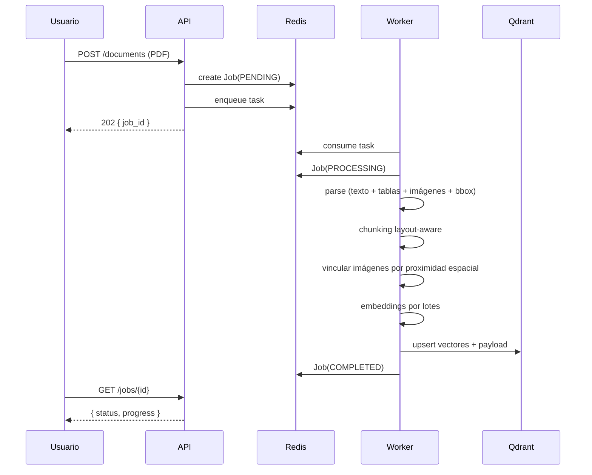
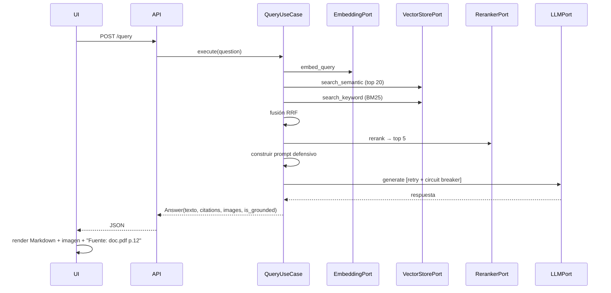
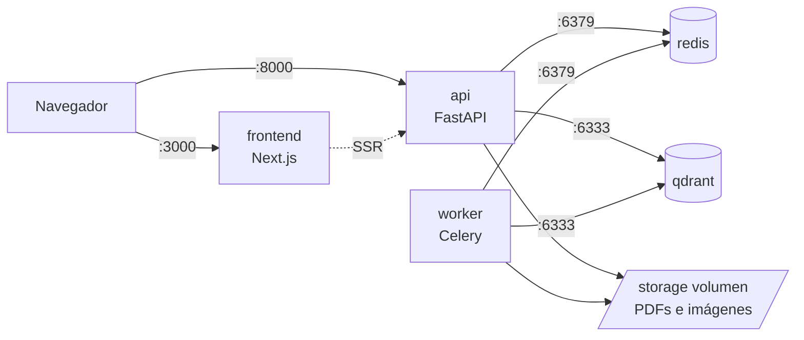

# RAG Multimodal — Sistema de Consulta sobre Documentación Técnica

Sistema **Retrieval-Augmented Generation** capaz de ingerir manuales técnicos en PDF —con texto, tablas, diagramas e imágenes— y responder preguntas en lenguaje natural citando la fuente exacta y **mostrando el diagrama asociado junto a la respuesta**.

> Este README es el documento rector del proyecto. Se actualiza en cada PR.

---

## 1. Análisis del problema

### 1.1 El problema de fondo

Un LLM no conoce la documentación privada de una organización, alucina cuando no sabe, y no puede recibir 500 páginas en cada consulta. RAG invierte el orden: primero se **recupera** la evidencia relevante desde los documentos propios, y luego se le pide al modelo que **razone y redacte únicamente sobre esa evidencia**.

### 1.2 Lo que hace difícil este caso concreto

| Desafío | Por qué importa | Cómo lo abordamos |
|---|---|---|
| **El PDF no es texto plano** | Es un lienzo con objetos posicionados; extraer "el texto" pierde tablas y estructura | PyMuPDF con extracción de bloques + coordenadas; pdfplumber para tablas |
| **El conocimiento está en los diagramas** | La respuesta a "¿cómo se conecta X?" vive en un esquema, no en un párrafo | Correlación espacial texto↔imagen vía bounding boxes |
| **Los códigos técnicos rompen la búsqueda semántica** | Un embedding no "entiende" `E-4021` ni `ref. ABC-991` | Búsqueda híbrida: densa (semántica) + sparse/BM25 (léxica), fusionadas con RRF |
| **Cortar mal destruye el significado** | Partir una tabla de torques la vuelve inútil e irrecuperable | Chunking layout-aware que respeta fronteras estructurales y nunca parte tablas |
| **La ingesta es pesada** | Un manual de 300 páginas tumba un request HTTP | Procesamiento en background con Celery y tracking de estado por `job_id` |
| **El LLM inventa** | Una respuesta inventada sobre mantenimiento industrial es un riesgo real | Prompt defensivo + citación obligatoria + verificación de groundedness |

### 1.3 Requisitos funcionales

- **RF-01** Ingesta asíncrona de PDF con `job_id` y consulta de progreso.
- **RF-02** Extracción multimodal: texto estructurado, tablas e imágenes con coordenadas.
- **RF-03** Indexación con chunking semántico/layout-aware en base vectorial.
- **RF-04** Recuperación híbrida (semántica + keyword) con re-ranking.
- **RF-05** Generación defensiva con citación explícita de documento y página.
- **RF-06** Asociación y renderizado de la imagen más cercana al contexto relevante.
- **RF-07** Interfaz de chat con historial y Markdown.

### 1.4 Requisitos no funcionales

- **RNF-01 Mantenibilidad** — arquitectura hexagonal, SOLID, tipado estático.
- **RNF-02 Intercambiabilidad** — cambiar OpenAI ↔ Ollama sin tocar la lógica core.
- **RNF-03 Escalabilidad** — el diseño debe soportar 100 manuales sin rediseño.
- **RNF-04 Resiliencia** — retries con backoff exponencial y circuit breaker.
- **RNF-05 Observabilidad** — logging estructurado con `correlation_id` extremo a extremo.
- **RNF-06 Testabilidad** — dominio y casos de uso testeables sin red ni contenedores.
- **RNF-07 Reproducibilidad** — `docker compose up` levanta todo el sistema.

### 1.5 Fuera de alcance

Autenticación y multi-tenancy, OCR de PDFs escaneados, streaming de tokens, y fine-tuning de modelos. Se documentan como evolución futura.

---

## 2. Arquitectura

### 2.1 Vista lógica (hexagonal)



**Regla de dependencia:** las flechas apuntan hacia adentro. `domain` no importa nada externo; `application` solo importa `domain`; `infrastructure` puede importar ambos. Se verifica automáticamente en CI.

### 2.2 Flujo de ingesta



### 2.3 Flujo de consulta



### 2.4 Vista de despliegue



---

## 3. Decisiones técnicas

Registro completo en `docs/adr/`.

| ADR | Decisión | Justificación resumida |
|---|---|---|
| 001 | Arquitectura hexagonal | Permite intercambiar LLM y vector store sin tocar la lógica core; hace el dominio testeable sin infraestructura |
| 002 | Qdrant sobre ChromaDB | Filtrado por payload más potente, soporte nativo de vectores sparse para búsqueda híbrida, y persistencia lista para producción |
| 003 | Chunking layout-aware | El corte por caracteres destruye tablas y descontextualiza fragmentos; la estructura del documento es la mejor frontera semántica disponible |
| 004 | Correlación espacial por bounding box | Vincular imagen y texto por geometría (misma página, proximidad vertical, solape horizontal) es determinista y barato frente a modelos multimodales pesados |
| 005 | Celery + Redis | Redis cumple doble rol (broker y store de estado de jobs), reduciendo servicios; Celery permite escalar workers horizontalmente |
| 006 | Búsqueda híbrida con RRF | Los identificadores técnicos no tienen representación semántica útil; BM25 los recupera y RRF fusiona ambos rankings sin calibrar pesos |
| 007 | PyMuPDF como parser primario | Es el único del stack sugerido que entrega texto e imágenes **con coordenadas**, requisito del mapeo espacial |

---

## 4. Estructura del proyecto

```
.
├── backend/
│   ├── src/
│   │   ├── domain/            # Entidades + Puertos. Sin dependencias externas.
│   │   ├── application/       # Casos de uso. Solo depende de domain.
│   │   ├── infrastructure/
│   │   │   ├── api/           # Routers, schemas, middlewares, handlers
│   │   │   ├── llm/           # OpenAIAdapter, OllamaAdapter
│   │   │   ├── embeddings/
│   │   │   ├── vector_store/  # QdrantAdapter, InMemoryAdapter
│   │   │   ├── parsers/       # PyMuPDFAdapter
│   │   │   ├── chunking/      # LayoutAwareChunker
│   │   │   ├── jobs/          # Celery app, RedisJobRepository
│   │   │   └── config/        # Settings + container de DI
│   │   └── main.py            # Composition root
│   └── tests/{unit,integration,e2e}/
├── frontend/
├── docs/{adr,diagrams,evaluation.md}
├── docker-compose.yml
├── docker-compose.dev.yml
├── docker-compose.staging.yml
├── .env.example
└── Makefile
```

---

## 5. Puesta en marcha

### Requisitos
Docker y Docker Compose. Opcionalmente Python 3.11+ para ejecutar tests fuera de contenedor.

### Arranque

```bash
git clone <url-del-repo> && cd <repo>
cp .env.example .env.development     # ajustar credenciales
make up                              # levanta api, worker, qdrant, redis, frontend
```

| Servicio | URL |
|---|---|
| Frontend | http://localhost:3000 |
| API | http://localhost:8000 |
| OpenAPI | http://localhost:8000/docs |
| Qdrant | http://localhost:6333/dashboard |

### Cambiar de proveedor LLM

```bash
# en .env
LLM_PROVIDER=ollama     # o: openai
```
Sin recompilar, sin tocar código: el contenedor de DI resuelve el adaptador en el arranque.

### Tests

```bash
make test              # unitarios (sin red, sin contenedores)
make test-integration  # adaptadores contra servicios reales
make lint              # ruff
make type-check        # mypy sobre domain y application
```

---

## 6. Ambientes

| | Development | Staging |
|---|---|---|
| Rama | `develop` | `main` |
| LLM | Ollama local | OpenAI |
| Logging | DEBUG, consola | INFO, JSON |
| Colección | `rag_chunks_dev` | `rag_chunks_staging` |
| `/docs` | Habilitado | Deshabilitado |

Detalle completo en la estrategia de ambientes del repositorio.

---

## 7. API

| Método | Endpoint | Descripción |
|---|---|---|
| `POST` | `/api/v1/documents` | Sube un PDF. Devuelve `202 { job_id }` |
| `GET` | `/api/v1/jobs/{job_id}` | Estado: `PENDING` / `PROCESSING` / `COMPLETED` / `FAILED` |
| `POST` | `/api/v1/query` | Pregunta en lenguaje natural. Devuelve respuesta, citas e imágenes |
| `GET` | `/api/v1/documents` | Lista documentos indexados |
| `DELETE` | `/api/v1/documents/{id}` | Elimina documento y sus vectores |
| `GET` | `/api/v1/images/{image_id}` | Sirve una imagen extraída |
| `GET` | `/health` | Estado del servicio |

---

## 8. Escalabilidad: ¿y con 100 manuales?

- **Ingesta** — los workers Celery escalan horizontalmente; la cola absorbe los picos y el throughput crece linealmente con las réplicas.
- **Embeddings** — batching de 100 textos por llamada; el cuello de botella es el rate limit del proveedor, mitigado con backoff.
- **Búsqueda** — el índice HNSW de Qdrant tiene coste logarítmico: pasar de 500 a 50.000 chunks no degrada de forma apreciable la latencia.
- **Precisión** — más volumen implica más ruido en el top-K; el re-ranking con cross-encoder mantiene la precisión constante al crecer el corpus.
- **Aislamiento** — el filtrado por payload (`document_id`, `collection`) permite particionar por cliente o dominio sin cambiar la arquitectura.
- **Almacenamiento** — las imágenes viven en volumen (migrables a S3/blob cambiando un solo adaptador, gracias al puerto).

---

## 9. Evolución futura

Autenticación y multi-tenancy · OCR para PDFs escaneados · streaming de respuestas vía SSE · caché semántica de consultas frecuentes · evaluación continua con RAGAS en CI · métricas Prometheus y trazas OpenTelemetry.
